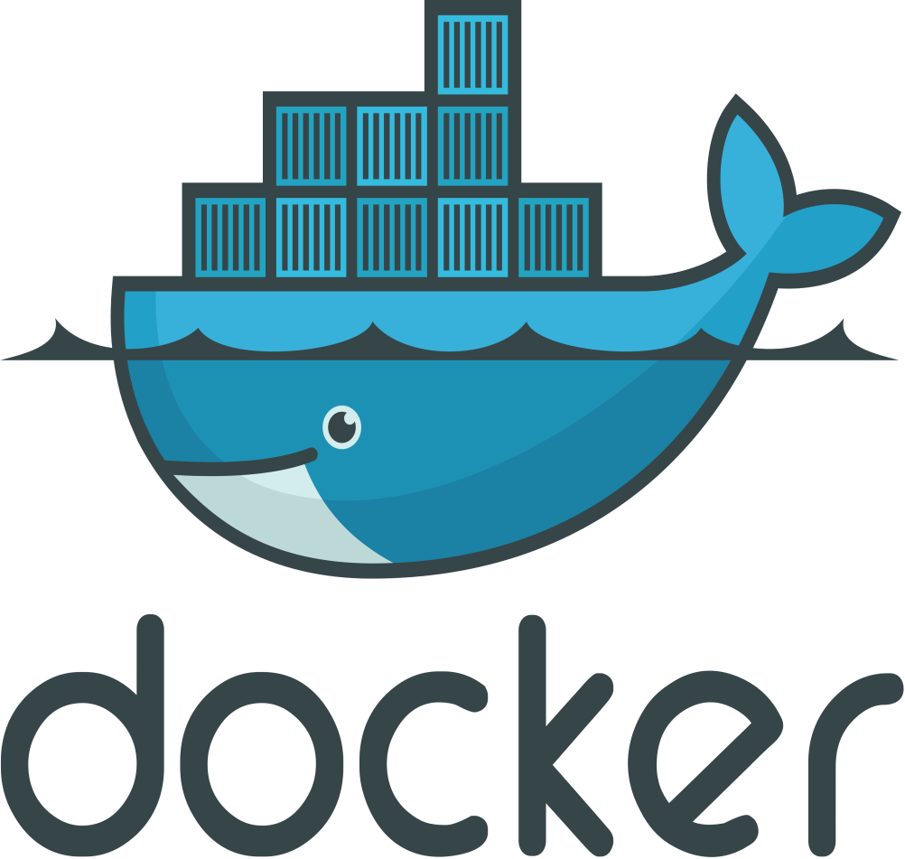
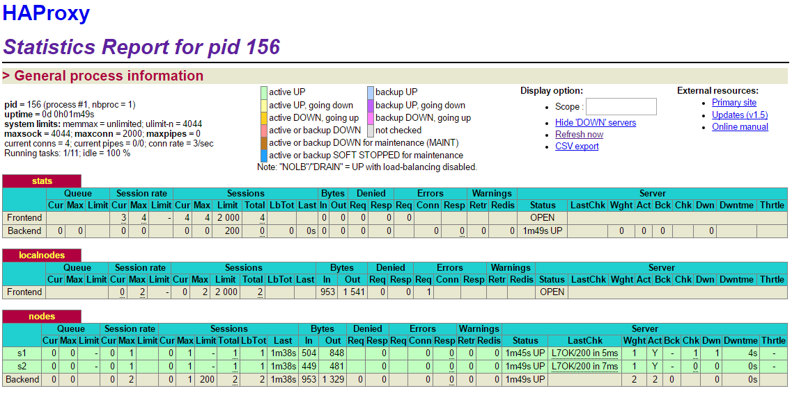
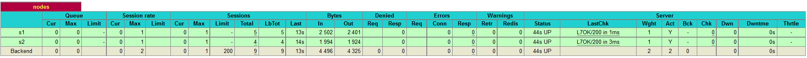

#Report AIT Lab 4 - Virtualization with Docker
## CIANI Antony – HERNANDEZ Thomas



### <a name="table_of_content"></a>Table of content

0. [Introduction](#introduction)
0. [Identify issues and install the tools](#task-0)
1. [Add a process supervisor to run several processes](#task-1)
2. [Add a tool to manage membership in the web server cluster](#task-2)
3. [React to membership changes](#task-3)
4. [Use a template engine to easily generate configuration files](#task-4)
5. [Generate a new load balancer configuration when membership changes](#task-5)
6. [Make the load balancer automatically reload the new configuration](#task-6)
7. [Difficulties](#difficulties)
8. [Conclusion](#conclusion)


### <a name="introduction"></a>Introduction

BLABLA INTRO BLABLA

##### Pedagogical objectives

* Build your own Docker images

* Become familiar with lightweight process supervision for Docker

* Understand core concepts for dynamic scaling of an application in production

* Put into practice decentralized management of web server instances


### <a name="task-0"></a>Task 0: Identify issues and install the tools

Suppose further currently your web servers and your load balancer are deployed like in the previous lab. What are the issues with this architecture? Answer the following questions. The questions are numbered from M1 to M6 to refer to them later in the lab. Please give in your report the reference of the question you are answering.

1. <a name="M1"></a>**[M1]** Do you think we can use the current
   solution for a production environment? What are the main problems
   when deploying it in a production environment?

	**Answer:**

	The current solution is clearly not designed for a production environment. Although it has some scalability capabilities because we could add manually new backend nodes and update the load balancer configuration file each time we do so, we still cannot do it in an easy, elegant and, most importantly, automatic fashion.
	

2. <a name="M2"></a>**[M2]** Describe what you need to do to add new
   `webapp` container to the infrastructure. Give the exact steps of
   what you have to do without modifiying the way the things are
   done. Hint: You probably have to modify some configuration and
   script files in a Docker image.


	**Answer:**

	1. We have to update the HAProxy configuration file with the new node we want to add. To do so we add the next line after the nodes already in the config file.
		
		``` server s3 <s3>:3000 check ```
	2. Next we have to change the run script for HAProxy so it will take in account the new container IP address and replace it in the line at the previous step. We do so by adding the line:
		
		``` sed -i 's/<s3>/$S3_PORT_3000_TCP_ADDR/g' /usr/local/etc/haproxy/haproxy.cfg```	

	3. We start a new container for the new node :
			
		``` docker run -d --name s3 softengheigvd/webapp ```


	4. At this point, if we start a HAProxy container, the configuration will not have changed, therefore we rebuild the HAProxy image to make the changes effective :
		
		``` docker build -t softengheigvd/ha . ```	

	5. Now we can restart the HAProxy container:

		``` docker run -d -p 80:80 -p 1936:1936 -p 9999:9999 --link s1 --link s2 -- link s3 --name s3 softengheigvd/ha ```

		
	
	We can see that this is a bit fastidious and long if we have to do so for each new node.
	


3. <a name="M3"></a>**[M3]** Based on your previous answers, you have
   detected some issues in the current solution. Now propose a better
   approach at a high level.

	**Answer:**

	Basically, what we would like to do is to have some kind of process that will detect the arrival of a new container when it goes up. With such a notification we could have another process automatically make the changes in the HAProxy configuration and then make it apply this new configuration. If a node goes down, it would be a good thing to remove it from HAProxy's configuration file.

4. <a name="M4"></a>**[M4]** You probably noticed that the list of web
  application nodes is hardcoded in the load balancer
  configuration. How can we manage the web app nodes in a more dynamic
  fashion?

	**Answer:**

	With a cluster membership management tool like Serf, if we put all the containers in the same cluster, be that they are new or already there, they would let know to each other when they arrive and wether they are still there. In this way, when a new backend node arrives, it can notify the HAProxy container which can perform a series of actions, typically some script, to make the new node part of its configuration.

5. <a name="M5"></a>**[M5]** In the physical or virtual machines of a
   typical infrastructure we tend to have not only one main process
   (like the web server or the load balancer) running, but a few
   additional processes on the side to perform management tasks.

	For example to monitor the distributed system as a whole it is
	common to collect in one centralized place all the logs produced by
	the different machines. Therefore we need a process running on each
	machine that will forward the logs to the central place. (We could
	also imagine a central tool that reaches out to each machine to
	gather the logs. That's a push vs. pull problem.) It is quite
	common to see a push mechanism used for this kind of task.
	
	Do you think our current solution is able to run additional
	management processes beside the main web server / load balancer
	process in a container? If no, what is missing / required to reach
	the goal? If yes, how to proceed to run for example a log
	forwarding process?

	**Answer:**

	Docker containers are designed to run only one main process, when the process ends, the containers stops as well. Therefore, our current solution is not able to run additional services. To solve this problem, we can use a process supervisor, which will act as the main process and will be in charge to start the other processes we wish to run simultaneously in the container.

6. <a name="M6"></a>**[M6]** In our current solution, although the
   load balancer configuration is changing dynamically, it doesn't
   follow dynamically the configuration of our distributed system when
   web servers are added or removed. If we take a closer look at the
   `run.sh` script, we see two calls to `sed` which will replace two
   lines in the `haproxy.cfg` configuration file just before we start
   `haproxy`. You clearly see that the configuration file has two
   lines and the script will replace these two lines.

	What happens if we add more web server nodes? Do you think it is
	really dynamic? It's far away from being a dynamic
	configuration. Can you propose a solution to solve this?

	**Answer:**

	As everything is hardcoded, if we add new nodes, they won't appear in HAProxy configuration. Therefore, they won't be of any use. To solve this issue, we need to change the way we replace some parts of the configuration file. To do so, we can use HAProxy configuration file as a base template and add some placeholders in it so they can be handled by a template engine which will extract the data it is provided (such as an IP address) and put it in the right place in our configuration file.

#### Install the tools

**Deliverables**:

1. Take a screenshot of the stats page of HAProxy at
   <http://192.168.42.42:1936>. You should see your backend nodes.

   

2. Give the URL of your repository URL in the lab report.

	[https://github.com/antonyciani/Teaching-HEIGVD-AIT-2016-Labo-Docker](https://github.com/antonyciani/Teaching-HEIGVD-AIT-2016-Labo-Docker)

### <a name="task-1"></a>Task 1: Add a process supervisor to run several processes


**Deliverables**:

1. Take a screenshot of the stats page of HAProxy at
   <http://192.168.42.42:1936>. You should see your backend nodes. It
   should be really similar to the screenshot of the previous task.

   
   


2. Describe your difficulties for this task and your understanding of
   what is happening during this task. Explain in your own words why
   are we installing a process supervisor. Do not hesitate to do more
   research and to find more articles on that topic to illustrate the
   problem.


### <a name="task-2"></a>Task 2: Add a tool to manage membership in the web server cluster

**Deliverables**:

1. Provide the docker log output for each of the containers: `ha`,
   `s1` and `s2`. You need to create a folder `logs` in your
   repository to store the files separately from the lab
   report. For each lab task create a folder and name it using the
   task number. No need to create a folder when there are no logs.

	- [Logs before Docker DNS problem solving](./logs/task2/Task2_2_Serf_Logs_Before_DNS_Solving.txt)  

	- [Logs when Ha is started first and then the backend nodes S1 and S2](./logs/task2/Task2_2_HaFirst_ThenS1AndS2.txt)

	- [Logs when the backend nodes are started first and then Ha](./logs/task2/Task2_2_S1S2FirstThenHa.txt)    


2. Give the answer to the question about the existing problem with the
   current solution.


3. Give an explanation on how `Serf` is working. Read the official
   website to get more details about the `GOSSIP` protocol used in
   `Serf`. Try to find other solutions that can be used to solve
   similar situations where we need some auto-discovery mechanism.


### <a name="task-3"></a>Task 3: React to membership changes


**Deliverables**:

1. Provide the docker log output for each of the containers:  `ha`, `s1` and `s2`.
   Put your logs in the `logs` directory you created in the previous task.

	- [Logs Ha started](./logs/task3/Task3_Ha_Before_S1.txt)  
	- [Logs Ha when S1 started](./logs/task3/Task3_Ha_After_S1_Join.txt)  
	- [Logs S1 ](./logs/task3/Task3_S1.txt)  

3. Provide the logs from the `ha` container gathered directly from the `/var/log/serf.log`
   file present in the container. Put the logs in the `logs` directory in your repo.

	- [Logs serf.log](./logs/task3/serf.log) 


### <a name="task-4"></a>Task 4: Use a template engine to easily generate configuration files


**Deliverables**:

1. You probably noticed when we added `xz-utils`, we have to rebuild
   the whole image which took some time. What can we do to mitigate
   that? Take a look at the Docker documentation on
   [image layers](https://docs.docker.com/engine/userguide/storagedriver/imagesandcontainers/#images-and-layers).
   Tell us about the pros and cons to merge as much as possible of the
   command. In other words, compare:

  ```
  RUN command 1
  RUN command 2
  RUN command 3
  ```

  vs.

  ```
  RUN command 1 && command 2 && command 3
  ```

  There are also some articles about techniques to reduce the image
  size. Try to find them. They are talking about `squashing` or
  `flattening` images.

2. Propose a different approach to architecture our images to be able
   to reuse as much as possible what we have done. Your proposition
   should also try to avoid as much as possible repetitions between
   your images.

3. Provide the `/tmp/haproxy.cfg` file generated in the `ha` container
   after each step.  Place the output into the `logs` folder like you
   already did for the Docker logs in the previous tasks. Three files
   are expected.
   
   In addition, provide a log file containing the output of the 
   `docker ps` console and another file (per container) with
   `docker inspect <container>`. Four files are expected.
   
4. Based on the three output files you have collected, what can you
   say about the way we generate it? What is the problem if any?


### <a name="task-5"></a>Task 5: Generate a new load balancer configuration when membership changes


**Deliverables**:

1. Provide the file `/usr/local/etc/haproxy/haproxy.cfg` generated in
   the `ha` container after each step. Three files are expected.
   
   In addition, provide a log file containing the output of the 
   `docker ps` console and another file (per container) with
   `docker inspect <container>`. Four files are expected.

2. Provide the list of files from the `/nodes` folder inside the `ha` container.
   One file expected with the command output.

3. Provide the configuration file after you stopped one container and
   the list of nodes present in the `/nodes` folder. One file expected
   with the command output. Two files are expected.
   
    In addition, provide a log file containing the output of the 
   `docker ps` console. One file expected.


### <a name="task-6"></a>Task 6: Make the load balancer automatically reload the new configuration


**Deliverables**:

1. Take a screenshots of the HAProxy stat page showing more than 2 web
   applications running. Additional screenshots are welcome to see a
   sequence of experimentations like shutting down a node and starting
   more nodes.
   
   Also provide the output of `docker ps` in a log file. At least 
   one file is expected. You can provide one output per step of your
   experimentation according to your screenshots.
   
2. Give your own feelings about the final solution. Propose
   improvements or ways to do the things differently. If any, provide
   references to your readings for the improvements.


### <a name="difficulties"></a> Difficulties


### <a name="conclusion"></a> Conclusion